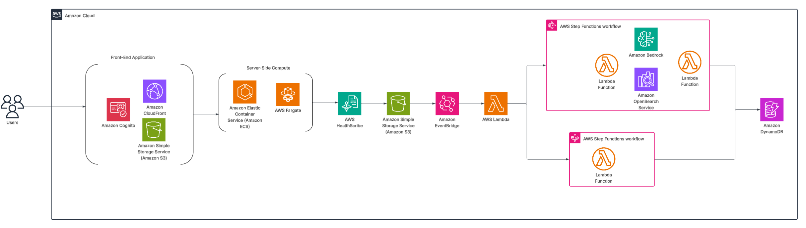

# AWS Healthscribe and Amazon Bedrock AI System for Clinical Analysis

A real-time audio transcription and clinical note generator featuring AI-powered multi-domain medical analysis and comprehensive care plan generation.

## 🏥 System Overview

This solution combines cutting-edge AI technologies to provide:
- **Real-time Audio Transcription** with AWS HealthScribe
- **12 AI Domain Specialists** for comprehensive medical analysis
- **Intelligent Care Plan Generation** with ICD-10 verification
- **Healthcare Data Processing** with HIPAA considerations
- **Modern React Frontend** hosted on Amazon S3/CloudFront with Amazon Cognito authentication

## Architecture Diagram


## 🏗️ Architecture

### Frontend ( Amazon S3 + Amazon CloudFront)
- **React + Vite**: Modern web application
- **Amazon S3 + Amazon CloudFront**: Static hosting with global CDN
- **Amazon Cognito Authentication**: Managed by AWS CDK
- **Real-time WebSocket**: Audio streaming interface
- **CloudScape Design**: Professional healthcare UI

### Backend Infrastructure (CDK)
- **Amazon Cognito User Pool**: Authentication and user management
- **AWS Lambda Functions**: Specialist AI agents
- **AWS Step Functions**: Multi-agent workflow orchestration
- **Amazon DynamoDB**: Visit data storage with enhanced security features
- **Amazon ECS Fargate**: WebSocket streaming service
- **Application Load Balancer**: HTTPS/WSS endpoint
- **Amazon S3 + Amazon CloudFront**: Frontend hosting

### Unified Architecture Approach

This solution uses a **unified CDK architecture**:

1. **All infrastructure managed by AWS CDK**: Provides core healthcare functionality (WebSocket, HealthScribe, data processing) as well as authentication (Cognito)
2. **S3/CloudFront hosting**: for easy deployment and cost
3. **Automated deployment**: with a single command

## 🚀 Deployment Guide

### Prerequisites

After cloning this project to your repository, run the following in local terminal:

1. **AWS CLI and CDK**
   ```bash
   npm install -g aws-cdk
   aws configure
   ```

2. **Container Runtime (Required for Amazon ECS deployment)**
   
   **Option A: Finch (Recommended - AWS's open-source container tool)**
   ```bash
   # Install Finch
   brew install finch
   
   # Initialize Finch
   finch vm init
   
   # Verify installation
   finch version
   ```
   
   **Option B: Docker Desktop**
   ```bash
   # Download from https://www.docker.com/products/docker-desktop/
   # Or install via Homebrew
   brew install --cask docker
   ```

3. **SSL Certificate (Required for HealthScribe streaming)**
   ```bash
   # Request certificate from ACM
   aws acm request-certificate --domain-name yourdomain.com --validation-method DNS
   
   # Get certificate ARN
   aws acm list-certificates
   ```


### Step 1: Deploy Backend Infrastructure

```bash
# Navigate to infrastructure directory
cd infrastructure

# Set CDK to use Finch (if using Finch)
export CDK_DOCKER=finch

# For dev deployment with custom domain
./deploy.sh dev \
    --certificate-arn arn:aws:acm:us-east-1:123456789:certificate/your-cert-id \
    --domain-name api.yourdomain.com
```

### Step 2: Deploy Frontend

```bash
# Navigate back to project root directory
cd .. 

# Install frontend dependencies
npm install

# For dev deployment
./scripts/deploy-frontend.sh dev
```

### What Gets Deployed
- ✅ **Cognito User Pool** for authentication  
- ✅ **All AWS Lambda functions** and Step Functions
- ✅ **Amazon DynamoDB tables** for data storage
- ✅ **Amazon ECS service** for WebSocket streaming
- ✅ **S3 bucket + CloudFront** for frontend hosting
- ✅ **Environment variables** automatically configured

**Access your app**: Use the CloudFront URL from the deployment output

Your application should now be up and running!

## 📊 System Components

### AI Specialists
1. **Diabetes Specialist**: Blood sugar and insulin management
2. **Allergy Specialist**: Allergen identification and management
3. **Kidney Specialist**: Renal function assessment
4. **Insurance Specialist**: Coverage and billing optimization
5. **Nutritionist**: Dietary recommendations
6. **Ophthalmologist**: Eye health assessment
7. **Podiatrist**: Foot and ankle care
8. **Hospital Care Team**: Inpatient coordination
9. **ADA Compliance**: Accessibility recommendations
10. **Social Determinants**: Social health factors
11. **Physical Therapist**: Mobility and rehabilitation
12. **Pharmacist**: Medication management

### Core Pipeline
- **Audio Transcription**: Real-time speech-to-text with HealthScribe
- **Summary Processing**: Medical summary generation
- **ICD-10 Verification**: Diagnostic code validation
- **Care Plan Generation**: Comprehensive treatment planning
- **Orchestrator**: Multi-agent coordination and decision making

## 🔍 Monitoring and Troubleshooting

### Check Deployment Status
```bash
# View CDK stack status
aws cloudformation describe-stacks --stack-name Asclepius-dev

# Check ECS service health
aws ecs describe-services --cluster asclepius-cluster-dev --services asclepius-service-dev

# View Lambda function logs
aws logs describe-log-groups --log-group-name-prefix /aws/lambda/asclepius
```

### Common Issues

1. **Certificate Validation**: Ensure ACM certificate is validated and issued
2. **WebSocket Connection**: Verify ALB security groups allow port 443
3. **Lambda Timeouts**: Check Amazon CloudWatch logs for function execution times
4. **AWS Step Functions Errors**: Monitor Step Functions execution history

## 🧹 Cleanup

```bash
# Destroy CDK infrastructure (buckets auto-empty in dev)
cd infrastructure
npx cdk destroy Asclepius-dev --force
```

## 📞 Support

For deployment issues:
1. Check AWS CloudFormation console for stack events
2. Review Amazon ECS service and task health
3. Monitor AWS Lambda function logs in CloudWatch
4. Verify AWS Step Functions execution history

## 🔒 Security Considerations

- All data transmission uses HTTPS/WSS encryption
- IAM roles follow least-privilege principles
- VPC isolates resources with proper security groups
- Healthcare data handling follows HIPAA guidelines
- Certificate-based authentication for all endpoints

## 🔧 Troubleshooting

### Common Issues and Solutions

#### 1. "Cannot find module 'commander'" Error
**Problem**: You have the npm version of `jq` installed instead of the native binary.

**Solution**:
```bash
npm uninstall -g jq
brew install jq
jq --version  # Should show "jq-1.8.1" or similar
```

#### 2. "Log group already exists" Error
**Problem**: Previous failed deployment left log groups behind.

**Solution**: The CDK stack now provides this automatically with explicit log group management. If you still encounter this:
```bash
# Delete specific log group
aws logs delete-log-group --log-group-name "/aws/lambda/function-name-dev"

# Or clean up all Asclepius log groups
aws logs describe-log-groups --log-group-name-prefix "/aws/lambda/asclepius" \
  --query 'logGroups[].logGroupName' --output text | \
  xargs -I {} aws logs delete-log-group --log-group-name {}
```

#### 3. Container Runtime Issues
**Problem**: CDK can't find Docker/Finch.

**Solutions**:
```bash
# For Finch
finch vm start
export CDK_DOCKER=finch

# For Docker
# Start Docker Desktop application
export CDK_DOCKER=docker

# Verify
docker ps  # or finch ps
```

#### 4. SSL Certificate Issues
**Problem**: Certificate ARN is invalid or not found.

**Solutions**:
```bash
# List available certificates
aws acm list-certificates --region us-east-1

# Request new certificate
aws acm request-certificate \
  --domain-name yourdomain.com \
  --validation-method DNS \
  --region us-east-1
```


### Getting Help

If you encounter issues not covered here:

1. **Check the AWS CloudFormation console** for detailed error messages
2. **Review Amazon CloudWatch logs** for Lambda function errors
3. **Verify your AWS permissions** include all required services
4. **Ensure your AWS account has sufficient limits** for the resources being created

### Clean Deployment

For a completely clean deployment:
```bash
# Delete existing stack (if needed)
aws cloudformation delete-stack --stack-name Asclepius-dev

# Wait for deletion to complete
aws cloudformation wait stack-delete-complete --stack-name Asclepius-dev

# Deploy fresh
cd infrastructure
./deploy.sh dev --certificate-arn <your-cert-arn> --domain-name <your-domain-name>
```

---

**Note**: This system processes sensitive healthcare information. Ensure compliance with relevant healthcare regulations (HIPAA, GDPR, etc.) in your deployment and usage.
